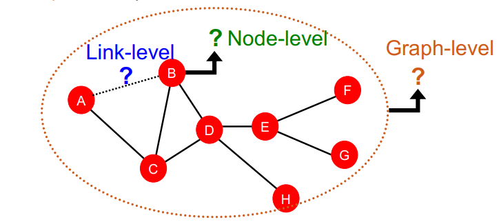
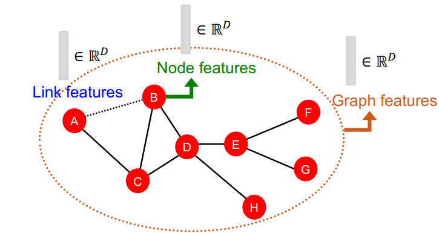
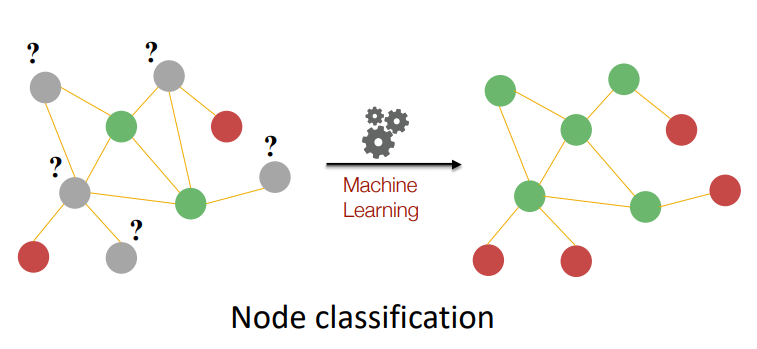
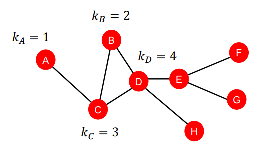
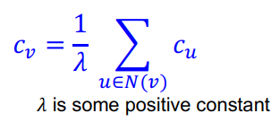
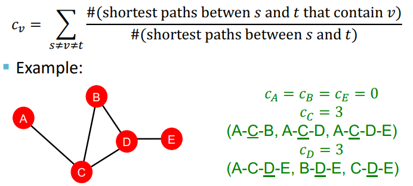
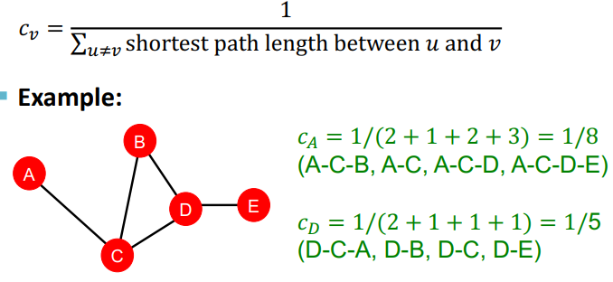
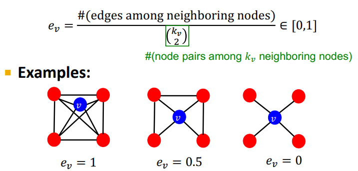
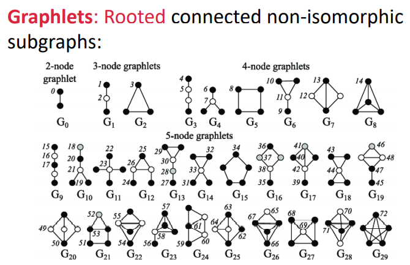
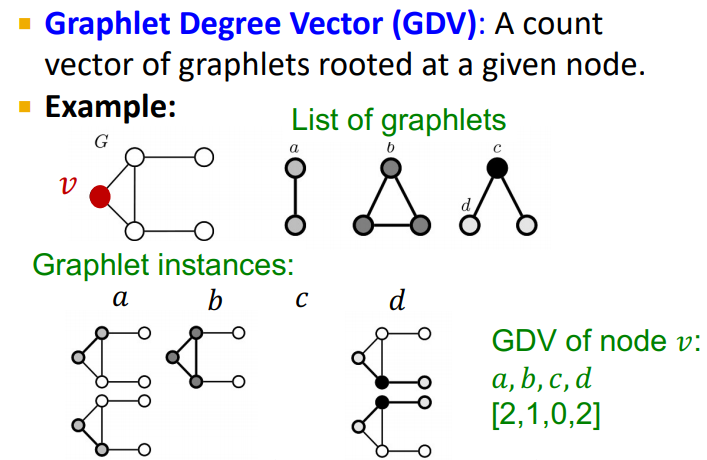

# 2021-05-09 스터디 (Lec 2 -1)

참고자료:  Hamilton-Graph Representation Learning, CS224W Lecture Note

# 1. Traditional Methods for ML in Graphs

## Graph에서의 ML task들은 다음과 같다.

- Node-level prediction
- Link-level prediction
- Graph-level prediction

## Traditional ML Pipeline의 경우에는

node / link / graph에 대한 feature들을 각각 design하게 된다. 그리고 모든 training data에 대해서 feature들을 포함하게 된다.

### Train ML model

- Random forest
- SVM
- Neural network 를 사용한다.

### Apply the model

- 주어진 새로운 node / link / graph에 대해서, feature를 이용해서 prediction을 한다.
- 

## This Lecture: Feature Design

위에 내용에서도 알 수 있듯이 좋은 성능을 얻기 위해서 핵심이 되는 것은

**Graph들에 대해서 효과적인 Feature를 사용하는 것**이다. 

Traditional ML pipeline에서는 hand-designed feature들을 사용한다.

Traditional feature들을 세가지 level에 대해서 보게 되는데, 다음과 같다.

- Node-level prediction
- Link-level prediction
- Graph-level prediction

여기서는 undirected graph만 다룬다.

## ML in Graphs

### Goal : Objects에 대한 Prediction

### Design choices :

- Features : d-dim vectors
- Objects : Nodes, Edges, Sets of Nodes, Entire Graphs
- Objective Function : 해결하려는 Task !!

### Notations

graph는 다음과 같이 표기하게 된다.

$ G=(V,E) $

이때 G는 그래프, V는 노드, E는 엣지를 의미한다.

그리고 학습하려는 function은 다음과 같이 표기한다.

$ f:V\rightarrow \mathbb{R} $

### 그렇다면 어떻게 function을 학습할까 ???

# 2. Node-level Tasks and Features

## Node-level Task ⇒ Node Classification

### 이 때 ML은 featurer가 필요하다 !!!

### Node-level Features' Goal

Network에서 **하나의 Node의 Structure와 Position**을 특정 짓는 것(characterize) !! 

**Node Feature의 종류**

- Node Degree
- Node Centrality
- Clustering Coefficient
- Graphlets

그러면 이제 Node Feature에 대해서 하나씩 보면

### 1) Importance, Structure-based Node Features: Node Degree

Node $ v $의 Degree $ k_v $는 Node가 가진 Edge들의 개수를 의미한다. 

즉, Node $ v $ 의 이웃 노드(neighboring node)의 개수를 의미하게 된다. 

그리고 이 때 이웃 노드들에 대해서 같게 취급한다. (weight값을 따로 고려하지 않는다)

### 2) Importance-based Node Features: Node Centrality

Node Degree에서는 단순히 이웃 노드들의 개수를 count하는 것이라면, 

Node centrality $ c_v $는 graph에서의 node importance를 고려한다.

Importance를 modeling하는 방법은 다양하게 있는데, 다음과 같다.

   **Engienvector centrality**

   node $ v $가 중요하다는 것의 근거는 노드 $ v $가 중요한 이웃 노드들 $ u\in N(v) $로 둘러싸여져 있다는 것이다 !! 
   node $ v $의 centrality는 다음과 같이 modeling된다.

   

   하지만 이렇게 model이 될 경우 Recursive한 형태를 띄게 되는데, 이 부분은 어떻게 해결할까 ???

   위 식을 다음과 같이 다시 적어볼 수 있다.

   

   여기서 우리는 Centrality를 eigenvector로 볼 수 있다 !!!

   가장 큰 eigenvalue인 $ \lambda_{max} $는 항상 positive하고 unique하다. (by Perron-Frobenius Theorem)

   Leading eigenvector인 $ c_{max} $는 Centrality 연산에 사용된다.

   그래서,,,, $ c_v $는 어떻게 연산을 하는가,,,, 기준을 Betweenness와 Closeness으로 나눠서 생각할 수 있다.

   **Betweenness Centrality**

   다른 노드들 사이의 Shortest Paths에 많이 나타날 수록 그 노드는 중요하다고 할 수 있다.

   

   **Closeness Centrality**

   다른 노드들로 가는 Shortest Path의 길이가 짧을 수록 그 노드는 중요하다고 할 수 있다.

   
         

   ### 3) Structure-based Node Features: Node Centrality

   node $ v $의 이웃 노드들이 어떻게 연결되어 있는지를 측정한다.

   
    

   **Clustering coefficient는 Ego-network에서의 triangle들의 개수를 count**하는 것이다.

   

   이것을 generalize한 것이 Graphlet들을 count하는 것이다.
    

   ### 4) Structure-based Node Features: Graphlets

   Graphlet의 정의는 다음과 같다.

   

   - **Graphlet Degree Vector (GDV) : Node들에 대한 Graphlet-base 특징**
   - Degree는 node에 연결된 edge들을 count
   - Clustering Coefficient는 node에 연결된 triangle의 갯수를 count
   - **GDV는 node에 연결된 Graphlet을 count**

   

   **GDV는 Node의 "Local Network Topology"의 Measure를 제공한다.** 
    

   # Summary

   ## Importance-based Features

   Graph에서 Node의 Importance를 찾아낸다.

   - Node Degree : 이웃 노드들의 개수를 count
   - Node Centrality : graph에서 이웃 노드들의 importance를 model

   Importance-based feature의 경우 graph에서 영향력 있는 노드를 predict할 때 유용하다.

   예를 들면, social network에서 celebrity user를 예측할 때 유용하다.
    

   ## Structure-based Features

   node 주위의 local neighborhood의 topological 특성을 찾아낸다.

   - Node Degree : 이웃 노드들의 개수를 count
   - Clustering Coefficient : 이웃 노드들이 어떻게 연결되어 있는지
   - Graphlet Degree Vector : 노드가 포함된 Graphlet들을 count

   Structure-based feature의 경우, graph에서 node가 특정한 역할을 하는지 예측할 때 유용하다.

   예를 들면, PPI network에서 protein functionality를 예측할 때 유용하다.

